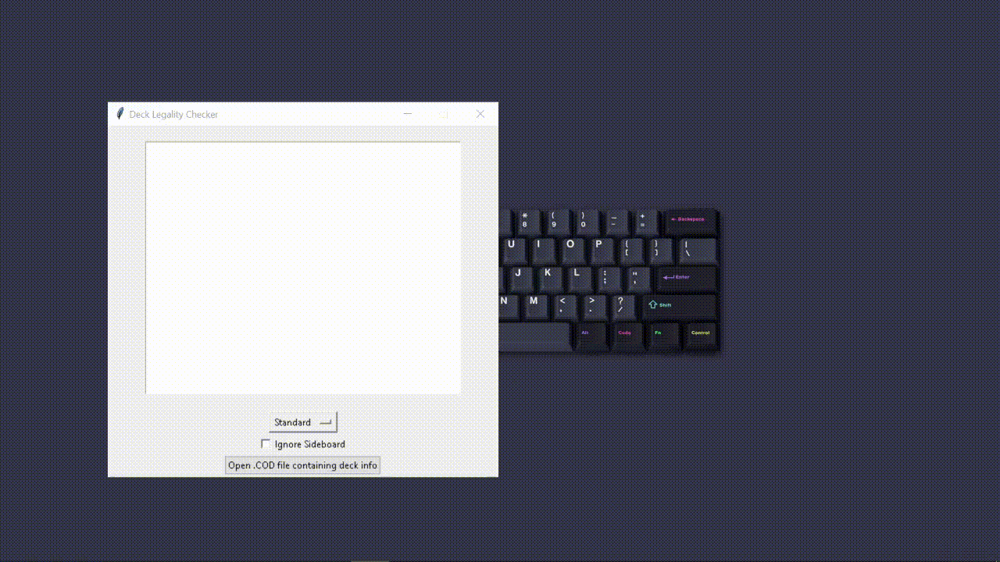

# MTG Deck Legality Checker
This program was made specifically for decks generated in [Cockatrice](https://cockatrice.github.io/). 

The main function of the program is to take in a Magic: The Gathering deck in .COD format and compare the cards against the mtgsdk library to determine whether the cards are allowed in any chosen game format.

The legalities of the cards and their respective colours are as follows:
- Legal: Green
- Not Legal: Gray
- Banned: Red
- Restricted: Orange

Libraries Used:
- [tkinter](https://docs.python.org/3/library/tkinter.html)
- [mtgsdk](https://magicthegathering.io/)

Example of the program being used:

